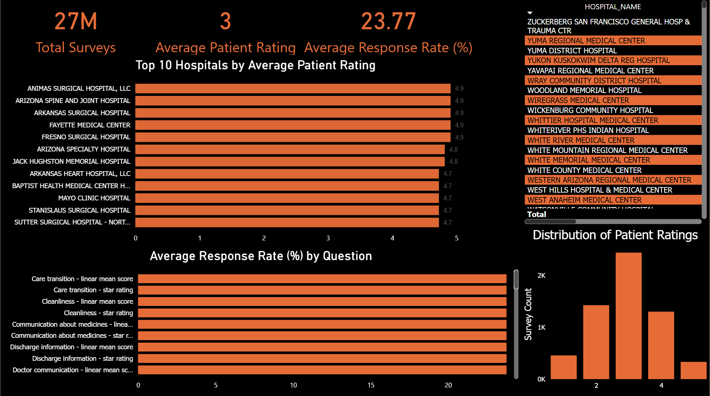

<p align="center">
  
</p>

# Healthcare Patient Survey Analytics Engineering Project

This project demonstrates an end-to-end Analytics Engineering workflow using AWS S3, Snowflake, dbt, SQL, Git, and Power BI. Raw CMS Hospital Patient Survey data is ingested, transformed using a Medallion Architecture, modeled into a dimensional star schema, 
and prepared for business intelligence reporting.

---

# Project Overview

This project simulates a production healthcare analytics pipeline.

Raw patient survey data is loaded from AWS S3 into Snowflake before being transformed through multiple data layers using dbt. The final Gold layer demonstrates a clean star schema optimized for BI reporting and analytical queries.

The project focuses on creating reusable, tested data models that support healthcare quality analysis.

---

# Business Problem

Hospitals collect patient satisfaction survey data covering topics such as:

- Hospital communication
- Patient experience
- Survey response rates
- Star ratings
- Linear mean scores
- Hospital performance measures

The raw dataset is not structured for analytics.

This project transforms the source data into an analytics-ready warehouse that enables:

- Hospital performance comparisons
- Survey response analysis
- Quality measure reporting
- KPI dashboards
- Historical trend analysis

---

# Technology Stack

- Snowflake
- dbt Cloud
- AWS S3
- SQL
- Git
- GitHub
- Power BI

---

# Architecture

```

AWS S3
│
Snowflake BRONZE
(Raw Data)
│
Snowflake SILVER
(Cleaned &
Standardized)
│
dbt Staging Models
│
dbt Gold Models
|
├── DIM_HOSPITAL
├── DIM_SURVEY
└── FACT_PATIENT_SURVEY
│
Power BI Dashboard

```

---

# Medallion Architecture

## Bronze Layer

Purpose:

- Store raw source data
- Preserve original records
- Minimal transformations

---

## Silver Layer

Purpose:

- Clean source data
- Standardize column names
- Remove unnecessary fields
- Prepare data for modeling

---

## Gold Layer

Purpose:

- Analytics-ready star schema
- Business-friendly dimensions
- Fact table containing measurable metrics
- Optimized for reporting

---

# Data Model

## Dimension Tables

### DIM_HOSPITAL

Contains one record per hospital including:

- Provider ID
- Hospital Name
- Address
- City
- State
- ZIP Code
- County
- Phone Number
- Location

---

### DIM_SURVEY

Contains survey metadata including:

- Measure ID
- Question
- Answer Description

---

## Fact Table

### FACT_PATIENT_SURVEY

Contains measurable survey metrics including:

- Answer Percent
- Linear Mean Value
- Patient Survey Star Rating
- Number of Completed Surveys
- Survey Response Rate
- Measure Start Date
- Measure End Date

---

# dbt Models

## Staging

- stg_patient_survey
- stg_hospital

Purpose:

- Clean source tables
- Standardize structure
- Create reusable staging layer

---

## Gold Models

### Dimensions

- dim_hospital
- dim_survey

### Facts

- fact_patient_survey

---

# Data Quality Testing

dbt tests implemented include:

✅ Unique primary keys

✅ Not Null constraints

✅ Relationship tests

Examples:

- Provider IDs must be unique
- Measure IDs cannot be null
- Fact table foreign keys must exist in their corresponding dimension tables

All tests successfully pass during:

```

dbt build

```

---

# Git Workflow

This project follows a standard Git workflow:

- Feature branch development
- Commits with descriptive messages
- Pull Request creation
- Merge into main branch

---

# Key Analytics Engineering Features

✔ AWS S3 external staging

✔ Snowflake ELT pipeline

✔ Bronze / Silver / Gold architecture

✔ dbt staging models

✔ Star schema design

✔ Data quality testing

✔ Dimensional modeling

✔ Git branching workflow

✔ Power BI reporting layer

---

# dbt Best Practices

This project follows recommended dbt development practices including:

- Modular SQL models
- Source definitions using `sources.yml`
- Layered staging and marts architecture
- Generic data quality tests
- Model dependency management using `ref()`
- Source dependency management using `source()`
- Centralized model documentation using `schema.yml`

---

# Example Analytics

The final warehouse supports analysis such as:

- Highest-rated hospitals
- Lowest survey response rates
- Survey participation by hospital
- Performance across quality measures
- Geographic hospital comparisons
- Healthcare KPI dashboards

---

# Repository Structure

```

healthcare-analysis/

├── models/
│   ├── staging/
│   │   ├── sources.yml
│   │   ├── stg_patient_survey.sql
│   │   └── stg_hospital.sql
│   │
│   └── marts/
│       ├── schema.yml
│       ├── dimensions/
│       │   ├── dim_hospital.sql
│       │   └── dim_survey.sql
│       │
│       └── facts/
│           └── fact_patient_survey.sql
│
├── 01_setup.sql
├── 02_ingestion.sql
├── 03_bronze.sql
├── 04_silver.sql
├── README.md

```

---

# Future Enhancements

- Incremental dbt models
- dbt documentation site
- Snowflake Tasks
- Snowflake Streams
- Automated pipeline scheduling
- CI/CD deployment
- Data observability
- Advanced Power BI dashboard

---
